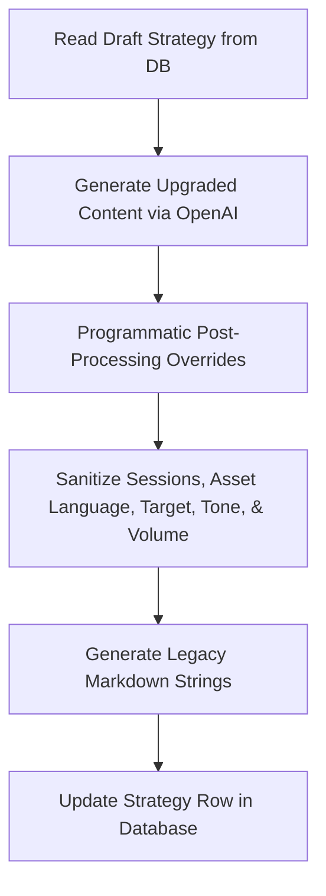

# Lurnava Strategy Vault — Codex Handoff Pack

Welcome! This handoff package contains everything Codex needs to know to continue the Lurnava Strategy Vault upgrades. 

All development coding on Phase 0-3 has stopped. Codex's objective is to execute **Batch 4** (Strategies 31–40) following the strict quality standards, visual architectures, and validation processes established below.

---

## 1. Project Overview & Status

Lurnava Academy is moving its Strategy Vault (the Technical Library / Strategy Lab) from a raw retail/draft strategy collection to high-fidelity, institutional-grade learning objects. Each strategy is represented in the database as a structured learning object featuring detailed entry/exit parameters, trap mechanics, student checklists, and interactive visual charting models.

### Completed Work
* **Batches 1, 2, and 3 are 100% complete**. 30 strategies have been upgraded in the database.
* **Seeding Completed**: All missing strategies were seeded using [seed-missing-strategies.ts](file:///c:/trading%20course/app/src/scripts/seed-missing-strategies.ts).
* **Database Synced**: The database has been synchronized using `prisma db push` and Client generated.
* **100% Validation Success**: All 30 upgraded strategies pass the strict 16-point validation suite.
* **Specialized Visuals Added**: A series of specialized interactive SVG chart components have been added to [StrategySetupVisual.tsx](file:///c:/trading%20course/app/src/components/academy/StrategySetupVisual.tsx) and all existing database strategies have been patched to reference them.
* **Upgraded Data Exported**: The 30 completed strategies are exported in [dumped_30_strategies.json](file:///c:/trading%20course/app/src/scripts/dumped_30_strategies.json) for audit and reference.

---

## 2. Database Schema & Architecture

### Strategy Model (`prisma/schema.prisma`)
The `Strategy` model uses two JSON fields to store the high-fidelity content:
1. `learningProfile` (JSON): Contains structural definitions like explanations, step-by-step logic, checklists, and timeframe/session rules.
2. `visualModel` (JSON): Contains configuration metadata for rendering interactive SVGs in the student UI.

For compatibility with legacy code, the database also stores the string representations of this data in `coreLogic`, `trapMechanics`, and `tradeWalkthrough` markdown fields.

```prisma
model Strategy {
  id               String    @id @default(uuid())
  assetClass       AssetType @map("asset_class")
  sequenceNumber   Int       @map("sequence_number")
  name             String
  parentFamily     String    @map("parent_family")
  coreLogic        String    @map("core_logic")
  trapMechanics    String?   @map("trap_mechanics")
  tradeWalkthrough String?   @map("trade_walkthrough")
  learningProfile  Json?     @map("learning_profile")
  visualModel      Json?     @map("visual_model")
  createdAt        DateTime  @default(now()) @map("created_at")
  updatedAt        DateTime  @updatedAt @map("updated_at")

  @@unique([assetClass, name], name: "assetClass_name")
  @@map("strategies")
}
```

---

## 3. Strategy Regeneration Workflow

Upgrading strategies is automated via the OpenAI API using the [upgrade-strategies-openai.ts](file:///c:/trading%20course/app/src/scripts/upgrade-strategies-openai.ts) script. The pipeline follows a multi-stage workflow:



### Stage 1: OpenAI Generation
The script queries OpenAI (`gpt-4o-mini`) using a system prompt that mandates strict structural JSON outputs containing `learningProfile` and `visualModel`.

### Stage 2: Post-Processing & Sanitation
To ensure quality controls are robust and independent of AI randomness, the script applies post-processing sanitations:
* **Visual Model Overrides (`overrideVisualModel`)**: Programmatically forces correct `componentType` mapping based on the strategy name. It appends the asset suffix ` [Strategy Name (AssetClass)]` to all `requiredLabels` and `requiredZones` to guarantee visual uniqueness.
* **Tone Sanitation**: Replaces vague words. Standardizes `MACD Signal Line` allowlist while filtering out other uses of the word "signal".
* **Asset-Language Sanitation**: Automatically maps Forex pip-based terminology to cryptocurrency or gold equivalents (percentage, basis points, points, ATR) depending on the `AssetType`.
* **Educational Target Sanitation**: Replaces profit target promises (e.g. "take profit at 3%") with structural reference zones.
* **Volume Sanitation**: Replaces absolute volume thresholds with relative simulated phrasing.

---

## 4. Visual Component Routing

Interactive visual representations are routed on the frontend via [StrategySetupVisual.tsx](file:///c:/trading%20course/app/src/components/academy/StrategySetupVisual.tsx). The client component reads `visualModel.componentType` and mounts the correct SVG layout:

| Component Type | Visual Category | Target Charts / Indicators |
| :--- | :--- | :--- |
| `MACDStructureChart` | `Indicator Structure Visual` | MACD Line, Signal/Trigger Line, Histogram bars, Zero Line |
| `ADXStrengthChart` | `Trend Continuation Visual` | ADX Line, threshold levels (e.g., 25), weak/strong trend zones |
| `MovingAverageCrossoverChart` | `Trend Continuation Visual` | Fast/Slow MA lines, crossover points, whipsaw/lag warning zones |
| `SessionBreakoutChart` | `Session / Time Window Visual` | Range boundary boxes (Asian Range), breakouts, sweeps, retests |
| `SupertrendVolatilityChart` | `Volatility / Trailing Stop Visual` | Stop lines, bullish/bearish flip dots, ATR volatility bands |
| `ParabolicSARChart` | `Volatility / Trailing Stop Visual` | Acceleration dots, reversal flips |
| `IchimokuCloudChart` | `Trend Continuation Visual` | Tenkan-sen (conversion), Kijun-sen (base), Senkou Span cloud |
| `HeikinAshiTrendChart` | `Trend Continuation Visual` | Smoothed Heikin-Ashi candles with flat tops/bottoms, trend markers |
| `DonchianChannelBreakoutChart` | `Session / Time Window Visual` | Donchian upper/lower bands (20-period high/low), breakouts |
| `SizingCalculator` | `Risk / Position Sizing Visual` | Interactive position sizing calculator |
| `GoldMacroRealYieldChart` | `Gold Macro Reaction Visual` | Inverted US 10Y Real Yield (TIPS) overlay vs Spot Gold |
| `ForexPairStrengthMeter` | `Forex Pair Strength Visual` | Base vs Quote relative strength meter |
| `DerivativesDashboard` | `Crypto Derivatives Visual` | Open Interest, Perp funding rates, Premium vs Spot basis |
| `CandlestickChart` (Default) | *Fallback* | General annotated candlestick support, resistance, invalidation |

**Note**: Programmatic required labels and zones are bound to these components. The component matches these exactly.

---

## 5. Validation Architecture

Validation is executed by [validate-batch-1.ts](file:///c:/trading%20course/app/src/scripts/validate-batch-1.ts). Although named `validate-batch-1.ts`, it is the **master validation script** that tests all database entries. 

It checks 16 strict rules before allowing a strategy to pass:
1. **No Placeholders**: Rejects placeholders like `TBD`, `Dummy`, `Placeholder`, or `Lorem Ipsum`.
2. **Schema Completeness**: Validates that all fields in `learningProfile` and `visualModel` are filled and meet minimum length constraints.
3. **Checklist Uniqueness**: Practice checklists must be unique across all strategies.
4. **Traps Uniqueness**: Common traps and beginner mistakes descriptions must be unique.
5. **Setup Steps Uniqueness**: Step-by-step setup logic must be unique.
6. **Visual Category Match**: Ensures the `visualCategory` matches the parent strategy family.
7. **Strategy-Specific Labels**: Checks that indicator-specific visuals actually contain the expected terms (e.g. moving average visuals must contain EMA/SMA/crossover references).
8. **Visual Zone Completeness**: Verifies all required zones and parameters are fully populated.
9. **Component Match**: Matches component types against allowed UI routes.
10. **Tone Cleanliness**: Rejects banned terms like "journey", "easy money", or "beginner".
11. **Fake Precision/Volume Constraints**: Rejects exact contract or absolute volume counts unless marked as simulated.
12. **Future-Level Concept Boundaries**: Prevents concept leakage (Level 1 cannot have EMA/SMA; Level 2 cannot have Macro Yields; Level 3 cannot have Session Timing; Level 4 cannot have Crypto Perps).
13. **Asset-Language Validation**: Ensures Crypto/Gold strategies contain zero pips terminology, and Forex strategies use correct pair/pips terminology.
14. **Strategy-Family Validation**: Blocks simple indicators from being misclassified under price action or macro categories.
15. **Target-Language Validation**: Blocks rigid profit targets ("take profit", "profit target", exact percentages) in favor of educational structural reference zones.
16. **Visual-Specific Validation**: Performs depth checks to ensure specialized indicators have their corresponding required labels and zones (e.g., MACD must specify the zero line, histogram, and crossover points).

---

## 6. Batch 4 Preflight Corrections & Directives

Codex must implement the following adjustments and corrections before executing the upgrade pipeline for Batch 4 strategies:

### 1. Bollinger Band Strategies (FOREX & GOLD)
Bollinger Band strategies must be clearly differentiated to avoid copy-paste checklists, traps, or setup logic:
* **Strategy 31 (Bollinger Band Trend Breakout — FOREX)**:
  - Focus on trend continuation, band expansion, and breakouts on major Forex pairs.
  - Must use Forex pip-based language.
  - Component type: `MovingAverageCrossoverChart` or `CandlestickChart` (configured for bands). Let's use `MovingAverageCrossoverChart` or standard `CandlestickChart` depending on whether MA is the main focus, but ensure required labels refer to Bollinger Bands.
* **Strategy 37 (Bollinger Band Breakout — GOLD)**:
  - Focus on Gold-specific volatility breakouts, high-wick fakeouts, and dollar-based movement.
  - Banned terms: Pips. Use Gold-specific metrics (points, dollars).
* **Strategy 40 (Bollinger Band Breakout Intraday — GOLD)**:
  - Focus on short-timeframe (5m/15m) squeezes, breakout, and rapid traps.
  - Banned terms: Pips. Focus on intraday volatility.

### 2. Price Channel & Donchian Channel breakouts
* **Strategy 34 (Price Channel Breakout — FOREX)**:
  - Should NOT be categorized as `Session / Time Window` by default.
  - Categorize as `Technical Breakout` or `Channel Breakout`.
  - Component: Standard `CandlestickChart` representing upper/lower channel boundaries.
* **Strategy 35 (Donchian Channel Breakout — CRYPTO)**:
  - Should NOT be categorized as `Trend Following` by default.
  - Categorize as `Technical Breakout` or `Channel Breakout`.
  - Must map to component type `DonchianChannelBreakoutChart`.
  - Banned terms: Pips. Focus on slippage, basis points, or spread percentage.

### 3. Market Structure Purity
* **Strategy 36 (Higher‑High & Higher‑Low Trend Structure — FOREX)**:
  - Must remain pure **Level 1**.
  - No concepts from Level 2+ (EMA, SMA, ATR, MACD, ADX, sessions, liquidity sweeps, or order blocks).
  - Focus strictly on swing structure, higher highs, and higher lows.
  - Component: Standard `CandlestickChart` with swing high/low labels.

### 4. Supertrend
* **Strategy 33 (Supertrend Indicator Strategy — CRYPTO)**:
  - Must map to `SupertrendVolatilityChart`.
  - Must include crypto volatility, slippage/liquidity depth cautions, and no pips language.
  - Must be clearly differentiated from Forex-based Supertrend strategies.

### 5. ATR Strategies
* **Strategy 38 (Volatility Breakout ATR Strategy — CRYPTO)**:
  - Focus on ATR expansion after a period of volatility compression.
* **Strategy 39 (Volatility‑Adjusted Trend ATR Filter — FOREX)**:
  - Focus on ATR trend filter and dynamic trailing stop adjustments.
  - Ensure these two do not share checklists, traps, or setup logic.

---

## 7. Execution Instructions

### Verification Commands
Codex must run these commands to verify the environment and test changes:
* **TypeScript Compilation**:
  ```bash
  npx tsc --noEmit
  ```
* **Validation Suite (Run after any strategy updates)**:
  ```bash
  npx tsx src/scripts/validate-batch-1.ts
  ```
* **Syncing Visual Models**:
  ```bash
  npx tsx src/scripts/patch-specialized-visuals.ts
  ```
* **Dumping Upgraded JSON**:
  ```bash
  npx tsx src/scripts/dump-all-30.ts
  ```

### File Inspection Checklist
Before running the upgrade pipeline, Codex must inspect the following files:
* [prisma/schema.prisma](file:///c:/trading%20course/app/prisma/schema.prisma) — Strategy model definition.
* [upgrade-strategies-openai.ts](file:///c:/trading%20course/app/src/scripts/upgrade-strategies-openai.ts) — The OpenAI regeneration pipeline.
* [validate-batch-1.ts](file:///c:/trading%20course/app/src/scripts/validate-batch-1.ts) — The master validation rules.
* [StrategySetupVisual.tsx](file:///c:/trading%20course/app/src/components/academy/StrategySetupVisual.tsx) — Visual rendering.
* [StrategySetupLogicCard.tsx](file:///c:/trading%20course/app/src/components/academy/StrategySetupLogicCard.tsx) — Markdown parser & page layout.
* [AGENTS.md](file:///c:/trading%20course/app/AGENTS.md) — Main developer guidelines.
* [dumped_30_strategies.json](file:///c:/trading%20course/app/src/scripts/dumped_30_strategies.json) — Reference file for existing completed work.
